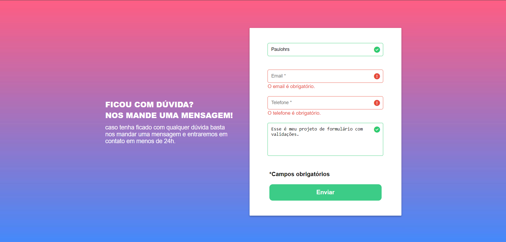

## Projeto - Formulário com validações ❗ - ✅
Desafio do Curso DevQuest com objetivo de fazer um formulário usando o Design passado do figma e as validações com JS puro. 

(No design do Desafio não tinha os "❗✅" mas quis fazer com)

#
## Sem Validação: 

## Com Validação:  

Link do projeto:  
https://paulohrs01.github.io/formulario1-devquest/

### Tecnologias utilizadas:
- HTML
- CSS
- JS